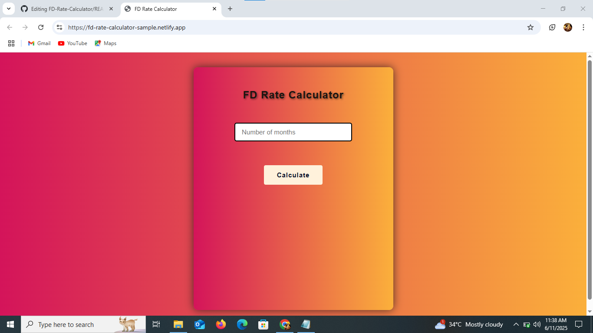
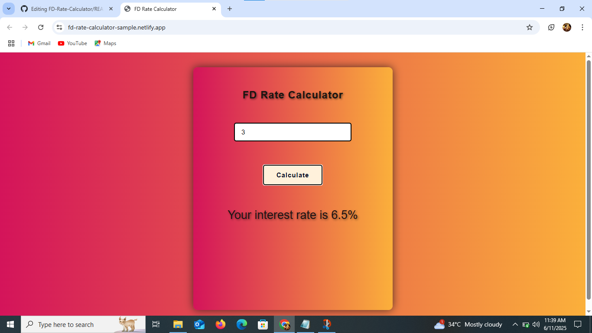

# FD Rate Calculator

A simple **Fixed Deposit (FD) Rate Calculator** built with **HTML**, **CSS**, and **JavaScript**. This tool helps users determine the applicable interest rate based on the number of months they plan to invest.

## Demo

[Live Demo](https://fd-rate-calculator-sample.netlify.app/)  

## Developed By
**Gayathri G**  
GitHub: [GAYATHRI1006](https://github.com/GAYATHRI1006)

## Screenshot

  
  

## Features

- Easy-to-use user interface
- Displays interest rate based on duration
- Input validation with friendly messages
- Instant results without page reload

## Interest Rate Slabs

| Duration (in months) | Interest Rate (%) |
|----------------------|-------------------|
| Less than 3 months   | 5.8%              |
| 3 to 6 months        | 6.5%              |
| 7 to 9 months        | 6.8%              |
| More than 9 months   | 7.0%              |

## How to Use

1. Open the `index.html` file in a browser.
2. Enter the number of months for the FD.
3. Click on **Calculate**.
4. The applicable interest rate will be shown below.

## Input Validation

- If the input is empty:  
  `Please enter a valid input`

- If the input is not a number:  
  `Please enter an input in numbers`

## 🛠️ Technologies Used

- HTML – for the structure
- CSS – for styling (`style.css`)
- JavaScript – for dynamic calculation and input validation

